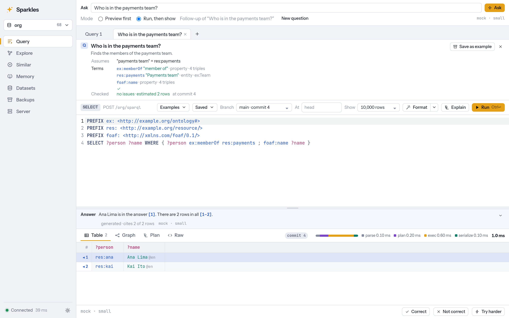
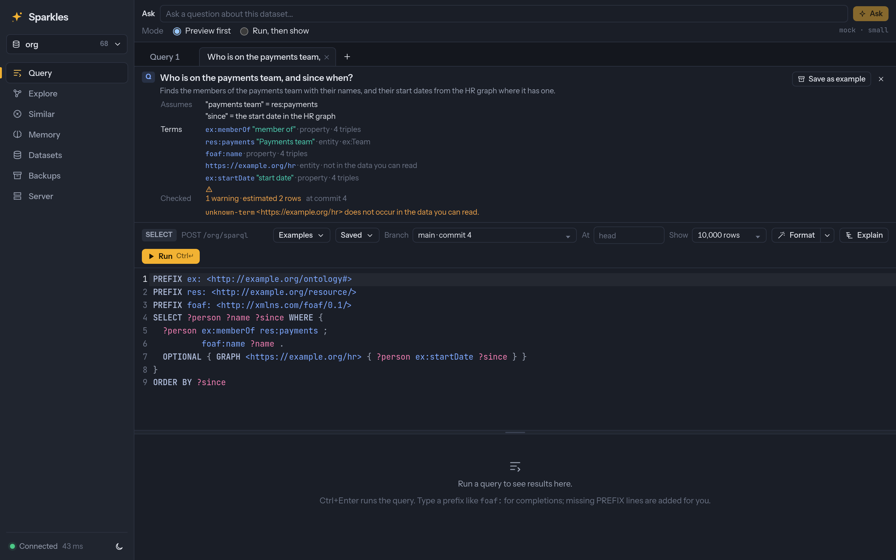
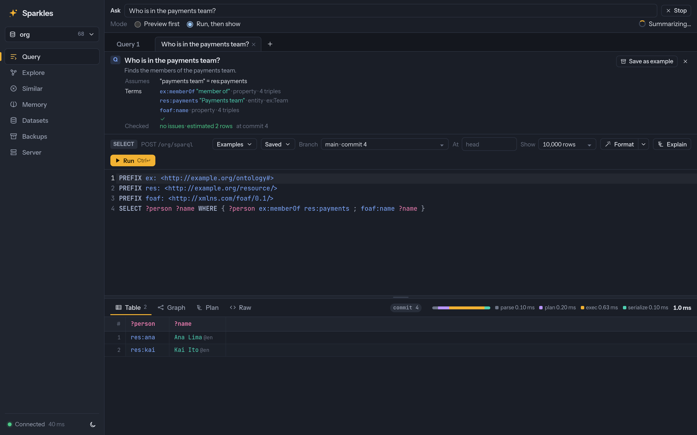
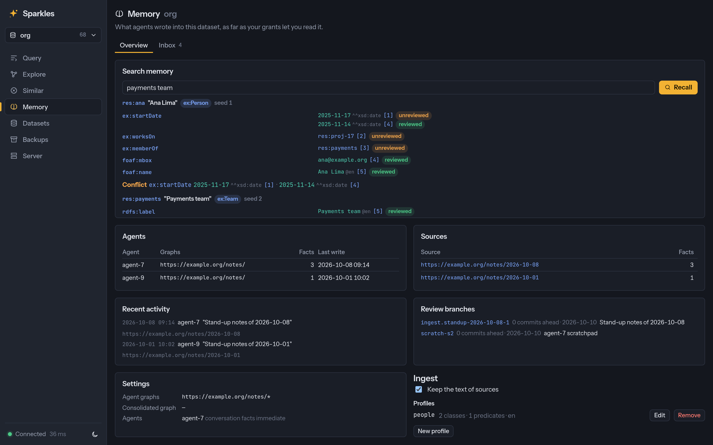
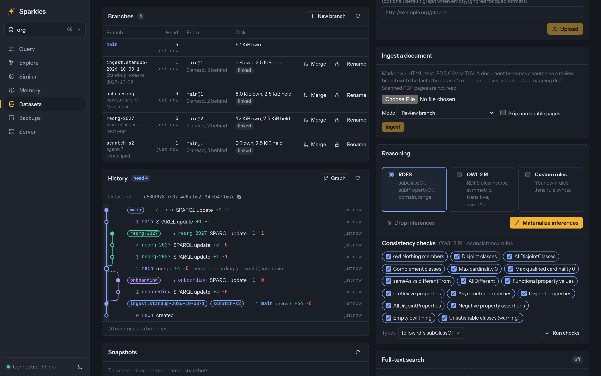
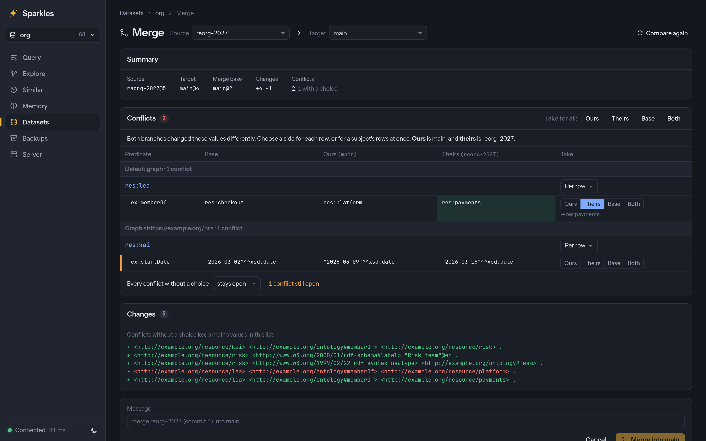

# Sparkles

Sparkles is a fast RDF, SPARQL and OWL database written in Rust. It reimplements
[Apache Jena](https://jena.apache.org/) and Fuseki, with their protocols, semantics and
operational model, on the index and execution architecture of
[QLever](https://github.com/ad-freiburg/qlever). It ships as an embeddable library with
Rust, Python, JVM and JavaScript APIs, a Fuseki-compatible server and CLI, and a web UI.

> [!WARNING]
> Sparkles is experimental. There are no releases, and the on-disk format, HTTP API, CLI
> and library APIs can change in any commit without a migration path. Don't use it for
> data you can't regenerate.
>
> Much of the code, tests and documentation was written with AI models, directed and
> reviewed by the maintainer. The W3C conformance suites and differential tests are the
> main safeguard, but expect bugs. Issues and bug reports are welcome.


## Why Sparkles

Jena and Fuseki have the protocols, tools and operational model that RDF applications
depend on, and QLever has an index and executor built for speed. Sparkles puts the first
on top of the second:

1. **Jena-compatible where users can see it.** Anything that talks to Fuseki keeps
   working. Sparkles implements the SPARQL 1.1 Query, Update and Graph Store protocols,
   Fuseki's endpoints and `/$/` admin API, Jena's formats and dataset semantics, and
   TDB2's model of bulk loads, transactions, compaction and backups.
2. **QLever-style internals where performance matters.** Terms are 64-bit ids with
   numbers and dates stored inline, indexes are sorted and compressed permutations, and
   a cost-based planner drives column-at-a-time execution. Sparkles adds MVCC
   transactions, durable commits, online compaction and a history that can be read,
   diffed and branched.
3. **Library first.** The engine is a library with no HTTP server. The server, the CLI
   and the Python, JVM and Node.js bindings are built on its public API, so an embedded
   program gets the same features as the server. The term model, parsers and SPARQL
   algebra come from the Oxigraph project's crates.

## Features

* **Storage and history.** MVCC snapshots, a crash-safe write-ahead log, parallel bulk
  loads and background compaction. Every commit can be read again by number, time or
  name, diffed as JSON or RDF Patch, and followed as a change feed. Branches share their
  upstream's index, merge with previews and conflict resolution, and back up on their own.
* **Query.** SPARQL 1.1 and SPARQL 1.2 pass the W3C suites, together with Jena ARQ's
  extensions and function libraries, federated `SERVICE` and query plans. Every query
  runs within memory, row and work budgets.
* **Search.** Full-text search through Jena's `text:query` with BM25 ranking, vector
  similarity with HNSW and embeddings computed on write, path search, and GeoSPARQL 1.1
  with a spatial index.
* **Reasoning and validation.** RDFS, OWL 2 RL and Jena rules kept current as data
  changes, SHACL and ShEx validation on request or on every write, and a schema report
  with exact counts.
* **Server.** Fuseki's endpoints and admin API with authentication, access control by
  dataset, graph and triple, stored queries, GraphQL, Prometheus metrics, an OpenAPI
  description, a Docker image and a NixOS module.
* **Agents.** An MCP server whose tools run with the caller's grants, an Ask bar that
  drafts, checks and runs a query from a question in plain language, ingestion that
  turns Markdown, HTML and PDF documents into cited facts on a review branch, and agent
  memory stored as reviewable graphs.
* **Tooling.** A `sparkles` CLI with equivalents of Jena's `tdb2.*`, `arq` and file
  tools, a formatter and linter for SPARQL and RDF, and a language server for editors.

[docs/FEATURES.md](docs/FEATURES.md) lists every feature and the known gaps.

## Getting started

Build from source, run it with Nix, or use Docker. Building the UI first embeds it in
the binary.

```sh
pnpm -C ui install && pnpm -C ui build        # the web UI, optional
cargo install --path crates/sparkles-server   # installs the `sparkles` binary
nix run github:kclejeune/sparkles -- serve --data ./data
docker compose up --build -d                  # UI and server on 127.0.0.1:3030
```

Load a file and serve it, or create a dataset on a running server:

```sh
sparkles load --loc ./books books.ttl
sparkles serve --data ./data --loc books=./books

curl -X POST 'localhost:3030/$/datasets' -d 'dbName=films&dbType=persistent'
curl -X POST 'localhost:3030/films/data?default' -H 'Content-Type: text/turtle' --data-binary @films.ttl
```

Query it over HTTP or from the command line:

```sh
curl localhost:3030/books/sparql -H 'Accept: text/csv' \
  --data-urlencode 'query=SELECT ?s ?p ?o WHERE { ?s ?p ?o } LIMIT 10'
sparkles query --loc ./books 'SELECT (COUNT(*) AS ?n) { ?s ?p ?o }'
sparkles query --data books.ttl --query q.rq   # files in memory, no database
```

The web UI is at <http://localhost:3030/ui/>. [docs/USAGE.md](docs/USAGE.md) covers
running and operating the server, and `sparkles help COMMAND` describes each command.

### Agents

`sparkles mcp` serves a database to an MCP host such as Claude Code or Claude Desktop.
A running server also serves MCP over HTTP at `/$/mcp`, with the caller's grants.

```sh
claude mcp add sparkles -- sparkles mcp --loc ./books
```

Agents get tools to explore the schema, check and run queries, recall and record facts,
and hand a query to the web UI for a person to review
([usage](docs/USAGE.md#mcp-server-llm-agents)). With a model configured, the server's
Ask bar answers questions in plain language ([usage](docs/USAGE.md#asking-questions-with-a-model)).

### Libraries and bindings

The `sparkles` crate is the embeddable library, with no HTTP server or async runtime by
default.

```rust
use sparkles::Dataset;

let ds = Dataset::open("mydb")?;                 // or Dataset::memory()
ds.load_file("data.ttl.gz")?;
for row in &ds.select("SELECT ?s ?name { ?s <http://xmlns.com/foaf/0.1/name> ?name }")? {
    println!("{} {}", row.get("s").unwrap(), row.get("name").unwrap());
}
```

The Python package has a pyoxigraph-style API and an rdflib store plugin:

```python
from sparkles import Dataset

with Dataset("mydb") as ds:
    ds.load(path="data.ttl.gz")
    for row in ds.query("SELECT ?s ?name WHERE { ?s <http://xmlns.com/foaf/0.1/name> ?name }"):
        print(row["s"], row["name"].value)
```

The JVM library gives Jena programs a `DatasetGraph`, so TDB2 code runs on Sparkles after
a change to the line that opens the dataset:

```java
try (DatasetGraphSparkles dsg = SparklesDatasets.open(Path.of("mydb"))) {
    Dataset ds = DatasetFactory.wrap(dsg);
    Txn.executeRead(ds, () -> { /* QueryExecution, Model and RIOT as usual */ });
}
```

The Node.js package embeds the engine with RDF/JS terms and asynchronous results:

```ts
import { Dataset } from '@sparkles-rdf/engine';

await using ds = await Dataset.open('mydb');
for await (const row of await ds.select('SELECT ?s ?name { ?s <urn:name> ?name }'))
  console.log(row.get('name')?.value);
```

The packages are not published to a registry. `mise run py:build`, `mise run jvm:build`
and `mise run node:build` build them, and [docs/USAGE.md](docs/USAGE.md#python) describes
each API.

## Performance

These figures come from one Intel Core i5-13500 with 16 GiB of RAM, with result caches
off and every engine's answers checked before timing.

| 10.5M triples | Sparkles | Best of the others |
|---|---|---|
| Bulk load | **3.9 s** | QLever 9.7 s |
| 28 benchmark queries | **Fastest on 27 of 28**, a median 3.9× faster than QLever | Fluree's `star-lookup` lead is within 10% |
| WatDiv, 20 templates | **4.84 ms** geometric mean | Fluree 7.41 ms |
| Throughput, 16 clients | **241 q/s** | QLever 92 q/s |
| Durable commit of one new literal | 1.28 ms | **Oxigraph 0.93 ms**, without synchronizing |
| Server memory after the run | 840 MiB, 379 MiB of it block cache | **QLever 653 MiB** |

On English DBpedia, 1.24 billion triples, Sparkles loads in 480 s against QLever's
1,674 s and Fluree's 2,919 s. It is faster than QLever on all 29 warm queries both
answer and on 29 of 31 cold ones, and faster than Fluree on every cold query. The bindings are faster than TDB2, pyoxigraph and Oxigraph's JavaScript
package on most of the same queries, and slower on some small lookups.

Sparkles uses more memory than QLever in exchange for this speed, mostly for a 1 GiB
decoded-block cache per dataset that can be made smaller.
[docs/BENCHMARKS.md](docs/BENCHMARKS.md) has every measurement, the cost of each memory
tradeoff and every case where Sparkles loses.

## Comparison

| Engine | Where Sparkles stands |
|---|---|
| [Apache Jena / Fuseki](https://jena.apache.org/) | The same protocols, endpoints, admin API, CLI model and ARQ extensions, on sorted columnar indexes. Reasoning is materialized, apart from RDFS on read, and there is no ontology API or JavaScript functions. |
| [QLever](https://github.com/ad-freiburg/qlever) | The same index and execution architecture, plus exact term identity, MVCC updates, the Graph Store Protocol, history, reasoning and validation. QLever is built for larger data and uses less memory. |
| [Fluree](https://github.com/fluree/db) | Both keep history and branches. Sparkles adds full W3C SPARQL conformance and Fuseki compatibility, and has no policies stored in the data or clustering. |
| [Oxigraph](https://github.com/oxigraph/oxigraph) | Sparkles uses Oxigraph's parsers and SPARQL parser with its own storage and planner. Sparkles synchronizes each commit, which makes single writes slower than Oxigraph's defaults. There is no WebAssembly build. |

[docs/COMPARISON.md](docs/COMPARISON.md) lists the gaps per engine and where Sparkles
departs from Jena and QLever on purpose.

## Web UI

The web UI is embedded in the server. It has a query editor with results as tables,
graphs and maps, a resource explorer, schema and validation views, branch history and
merges, the Ask bar, and agent memory.

<table>
  <tr>
    <td></td>
    <td></td>
  </tr>
  <tr>
    <td>A question answered with a checked query and a cited summary</td>
    <td>A query an agent handed over for review</td>
  </tr>
  <tr>
    <td></td>
    <td></td>
  </tr>
  <tr>
    <td>The steps of an answer as they run</td>
    <td>What agent memory holds, with sources</td>
  </tr>
  <tr>
    <td></td>
    <td></td>
  </tr>
  <tr>
    <td>Branches and their history</td>
    <td>A merge preview with a conflict to resolve</td>
  </tr>
  <tr>
    <td></td>
    <td></td>
  </tr>
  <tr>
    <td>The query editor and its results</td>
    <td>The resource explorer</td>
  </tr>
  <tr>
    <td></td>
    <td></td>
  </tr>
  <tr>
    <td>The schema browser</td>
    <td>GeoSPARQL results on a map</td>
  </tr>
</table>

## Documentation

| Document | Contents |
|---|---|
| [docs/FEATURES.md](docs/FEATURES.md) | Every feature by area, and the known gaps. |
| [docs/USAGE.md](docs/USAGE.md) | The server and CLI, backups, MCP, the libraries and bindings, Docker and NixOS. |
| [docs/API.md](docs/API.md) | The HTTP API: Fuseki's endpoints and the `/$/` extensions. |
| [docs/openapi.json](docs/openapi.json) | The OpenAPI 3.1 description the server serves at `/$/openapi.json`. |
| [docs/COMPARISON.md](docs/COMPARISON.md) | Feature gaps against Jena/Fuseki, QLever, Fluree and Oxigraph, and departures from Jena and QLever. |
| [docs/BENCHMARKS.md](docs/BENCHMARKS.md) | Query, load, write, bindings and memory measurements against other engines, and how to reproduce them. |
| [docs/editors.md](docs/editors.md) | Formatter and language-server setups for editors. |
| [docs/DEVELOPMENT.md](docs/DEVELOPMENT.md) | Building, mise tasks, tests, Nix and third-party licenses. |
| [Design specs](docs/specs/README.md) | Why each feature is built the way it is. |
| [docs/AUDIT.md](docs/AUDIT.md) | The Jena and QLever audits, and what Sparkles reuses from Oxigraph. |
| [ui/README.md](ui/README.md) | Developing the web UI. |

## Project layout

| Path | Role | Jena analogue |
|---|---|---|
| `crates/sparkles-core` | The engine: ids, vocabulary, indexes, bulk builder, MVCC store and WAL, SPARQL and RDF I/O | jena-core, jena-arq, jena-tdb2 |
| `crates/sparkles` | The library: the engine's modules, the `Dataset` API, its handles and the query builder | jena-querybuilder, in-process RDFConnection |
| `crates/sparkles-server` | The HTTP server and the `sparkles` CLI | jena-fuseki2, jena-cmds |
| `crates/sparkles-reasoner` | RDFS, OWL 2 RL and Jena rules by semi-naive forward chaining | jena-core `reasoner` |
| `crates/sparkles-shacl`, `crates/sparkles-shex` | SHACL and ShEx validation over store snapshots | jena-shacl, jena-shex |
| `crates/sparkles-backup` | Backup repositories on a file system or S3 | Fuseki `/$/backup` |
| `crates/sparkles-graphql` | The read-only GraphQL adapter | — |
| `crates/sparkles-fmt`, `crates/sparkles-fmt-wasm` | The formatter and linter, and their WebAssembly build | — |
| `crates/sparkles-client` | The Rust client of remote SPARQL endpoints | jena-rdfconnection (remote) |
| `crates/sparkles-py` | The Python package (PyO3, its own cargo workspace) | — |
| `crates/sparkles-ffi`, `jvm/` | The JVM bindings: the UniFFI native library and the Kotlin `sparkles-jena` library | jena-tdb2's `DatasetGraphTDB` |
| `crates/sparkles-node`, `js/` | The Node-API addon, RDF/JS contracts and TypeScript engine and remote client packages | — |
| `vendor/spargebra` | Oxigraph's SPARQL parser, vendored with fixes ([PATCHED.md](vendor/spargebra/PATCHED.md)) | ARQ's grammar |
| `ui/` | The SvelteKit web UI | jena-fuseki-ui |

## Development

`mise run ci` runs the formatting checks, the check of the source paths the docs cite,
Clippy over the workspace and over feature combinations, the WebAssembly build of the
formatter, every workspace test, the UI's type check and tests, the Python, JVM and
Node bindings' lints and tests, and the third-party license check. `mise run ci:fast`
runs only the formatting, doc path, Clippy and workspace test steps. `mise run
test:w3c`, `test:shacl` and `test:shex` run the conformance suites from an Apache Jena
checkout. [docs/DEVELOPMENT.md](docs/DEVELOPMENT.md) covers the rest.

## License

Sparkles is licensed under the [Apache License 2.0](LICENSE). The vendored `spargebra`
keeps its MIT OR Apache-2.0 license. The licenses of the crates and npm packages that
ship in the binary are in [THIRD_PARTY_LICENSES.md](THIRD_PARTY_LICENSES.md) and
[THIRD_PARTY_LICENSES-UI.md](THIRD_PARTY_LICENSES-UI.md).
