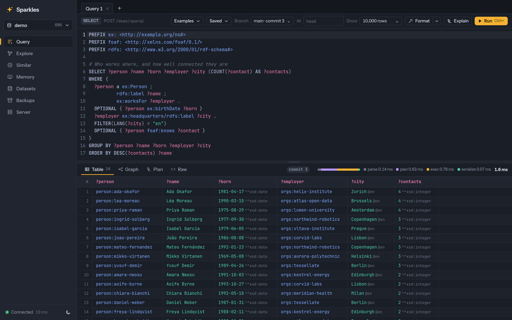
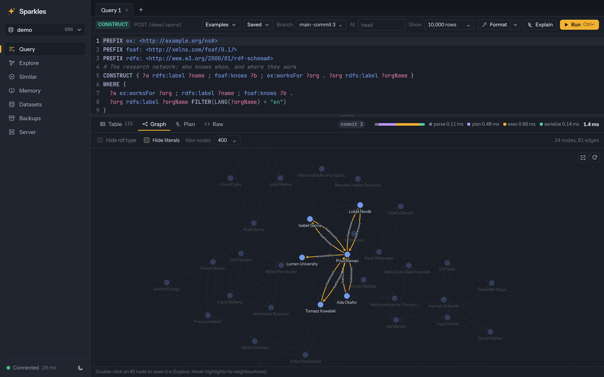
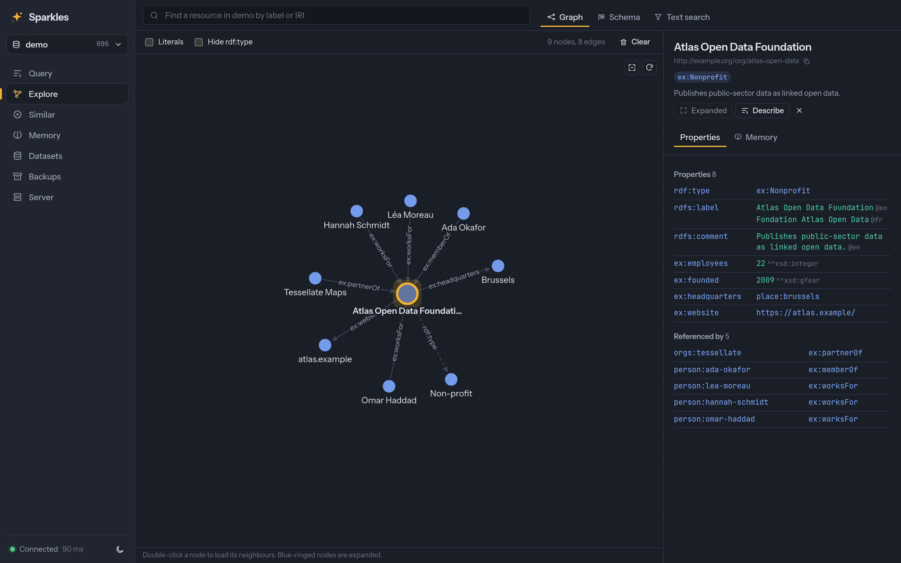
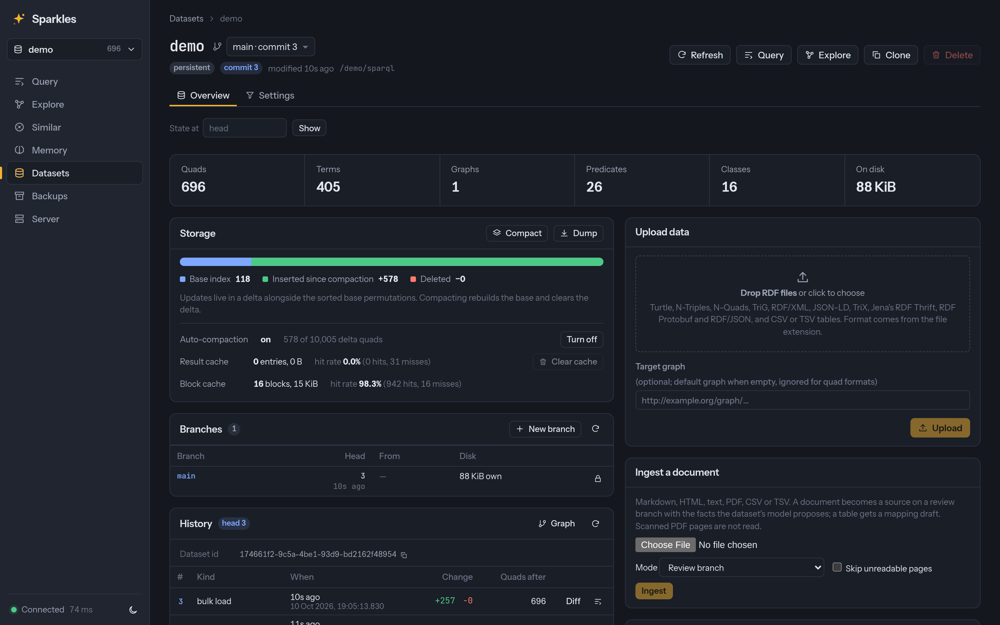
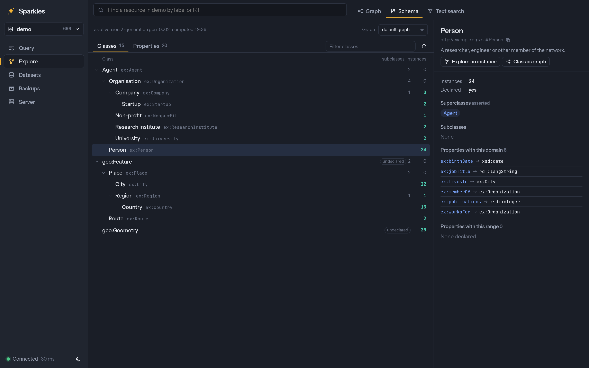
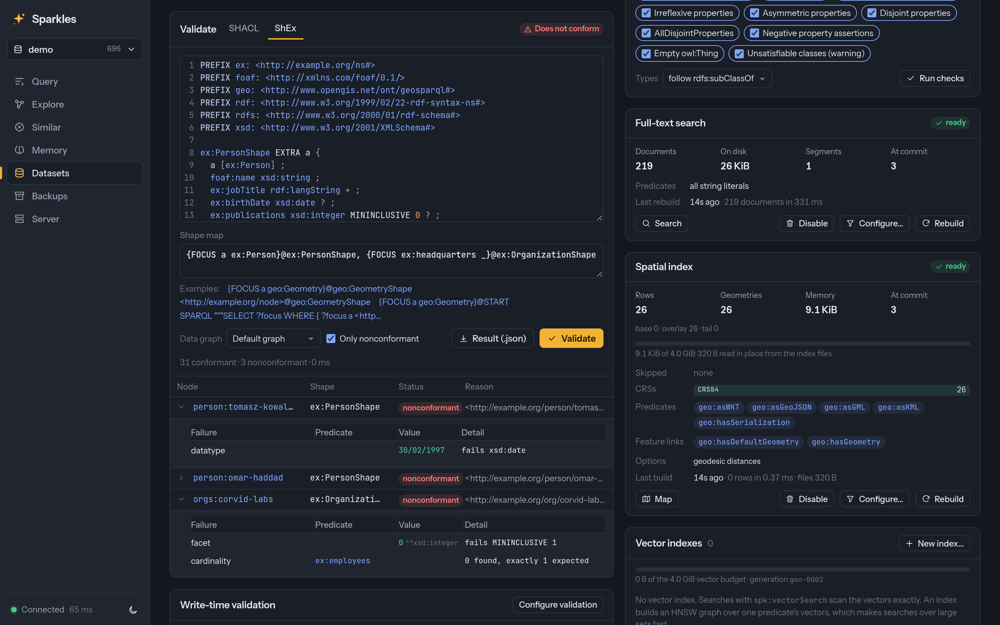
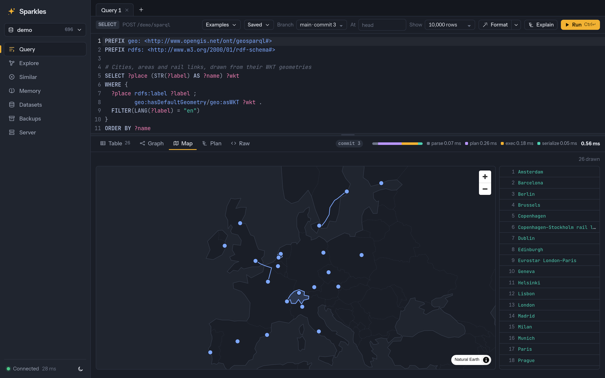

# Sparkles

Sparkles is a fast RDF, SPARQL and OWL database written in Rust. It reimplements
[Apache Jena](https://jena.apache.org/) and Fuseki, with the same protocols, semantics and
operational model, on the index and execution architecture of
[QLever](https://github.com/ad-freiburg/qlever). It ships as an embeddable library, a
Fuseki-compatible server and CLI, and a web UI for managing databases, exploring graphs and
running queries.

> [!WARNING]
> Sparkles is experimental and not yet stable. There are no releases and no stability
> guarantees. The on-disk format, HTTP API, CLI and Rust API can change in any commit,
> without notice or a migration path. Sparkles is not recommended for production or for
> data you can't regenerate. Keep backups.
>
> Much of the code, tests and documentation was written with AI models, directed and
> reviewed by the maintainer. The W3C conformance suites and differential tests are the
> main safeguard, but expect bugs. Issues and bug reports are welcome.



## Philosophy

1. **Jena-compatible where users can see it.** Anything that talks to Fuseki should keep
   working. Sparkles implements the SPARQL 1.1 Query, Update and Graph Store protocols,
   Fuseki's endpoint names (`/{ds}/sparql|query|update|data|get|upload`) and the `/$/`
   admin API. It follows Jena for RDF and result formats and for dataset semantics: a
   default graph, named graphs and an optional union default graph. It keeps TDB2's
   operational model of bulk loads, transactions, compaction and backups.
2. **QLever-style internals where performance matters.** Terms are dictionary-encoded as
   64-bit tagged ids, and literals such as numbers and dates are stored inline in the id.
   Indexes are fully sorted, compressed permutation files. A cost-based DP planner drives
   column-at-a-time execution.
3. **Reuse the Rust RDF ecosystem.** Sparkles doesn't rewrite parsers that already exist.
   The term model, parsers, SPARQL algebra and XSD value space come from the Oxigraph
   project's crates: `oxrdf`, `oxttl`, `oxrdfxml`, `oxjsonld`, `spargebra`, `sparesults`
   and `oxsdatatypes`. Sparkles adds the storage, planner, executor, server, reasoner and
   UI.
4. **Library first.** `crates/sparkles` is an embeddable engine with no HTTP or async
   dependencies. It is the counterpart of Jena's `core`, `arq` and `tdb2`. The server
   (`sparkles-server`, the Fuseki equivalent) and the reasoner are separate crates built on
   its public API.

## Highlights

**Storage and engine**
* MVCC snapshots with a single writer and a crash-safe WAL. Compaction writes immutable
  generations of 7 sorted, compressed permutations ([features](docs/FEATURES.md#storage-tdb2-equivalent)).
* Automatic compaction in the background when a dataset's updates grow, with writes going
  on during the build ([API](docs/API.md#automatic-compaction)).
* Durable commit ids, point-in-time reads by commit (`?at=commit:N`), time or named
  snapshot, and diffs between any two readable commits, as JSON or RDF Patch
  ([API](docs/API.md#point-in-time-reads-and-snapshots)).
* A change feed of commits and their changes, resumable from any readable commit, with
  long polling and server-sent events ([API](docs/API.md#change-feed)).
* Commit messages, optional change digests, and Graph Store entity tags with `If-Match`
  writes checked under the writer lock ([API](docs/API.md#entity-tags-and-conditional-requests)).
* Dry runs of updates, Graph Store writes and uploads. A dry run reports the commit, the
  changes per graph, the validation result and the quota effect, and writes nothing
  ([API](docs/API.md#write-previews)).
* A read-only integrity check ([usage](docs/USAGE.md#checking-a-database)).
* Parallel bulk loading with external sort.
* N-Quads dumps, and incremental, deduplicated backups of persistent and in-memory
  datasets to a file system or S3 ([usage](docs/USAGE.md#backup-repositories)).

**SPARQL**
* SPARQL 1.1 Query and Update, and SPARQL 1.2 / RDF 1.2. Sparkles passes the W3C suites
  in full: SPARQL 1.0 482/482, 1.1 query 328/328, 1.1 update 157/157 and 1.2 269/269.
* A cost-based DP planner over columnar operators, a result cache, and memory, row and
  work budgets per query, which a request can lower. Each result comes with its executed
  plan ([optimizations](docs/COMPARISON.md#optimizations-adopted-from-qlever)).
* Jena ARQ's statistical aggregates (`MEDIAN`, `MODE`, `STDEV`, `VARIANCE` and their
  variants) and most of its `fn:`, `afn:` and `math:` functions, checked against Jena's
  answers ([API](docs/API.md#extension-functions-and-aggregates)).
* A SPARQL 1.1 Service Description per dataset ([API](docs/API.md#service-description)).
* Federated `SERVICE` queries under an outbound network policy ([usage](docs/USAGE.md#outbound-requests-service-and-load)).

**Server and CLI**
* Fuseki's endpoints, Graph Store Protocol, upload and `/$/` admin API. Sparkles adds
  endpoints for commits, schema discovery, clones, reasoning and validation ([API](docs/API.md)).
* Stored queries with typed parameters, which clients and MCP agents run by name. Values
  are bound as terms and never spliced into the text ([API](docs/API.md#stored-queries)).
* Jena's own HTTP clients, including `RDFConnectionFuseki` and its RDF Thrift, are tested
  against the server ([usage](docs/USAGE.md#fuseki-and-jena-clients)).
* A Jena-style CLI with `tdb2.*` and `arq` equivalents. The commands work on a database
  directory or on a remote server ([usage](docs/USAGE.md#command-line-tools)).

**Reasoning**
* RDFS, OWL 2 RL and Jena's rule syntax, materialized by semi-naive forward chaining.
* Sparkles reports when inferences are stale and, if asked, re-runs them automatically.
  A re-run updates the previous materialization incrementally, so a small change takes
  milliseconds. Sparkles also checks for OWL 2 RL inconsistencies
  ([API](docs/API.md#reasoning-status-and-diagnostics)).
* The reasoner reads the default graph or chosen data and ontology graphs, and follows
  `owl:imports` to graphs of the dataset or fetches them
  ([API](docs/API.md#input-graphs-and-imports)).
* RDFS on read answers queries over the RDFS closure without materializing it, with the
  same answers as Fuseki's `--rdfs` ([API](docs/API.md#rdfs-on-read)).

**Validation**
* SHACL Core and SHACL-SPARQL, with Fuseki's `/{ds}/shacl` endpoint. Both W3C suites
  pass (98/98 and 20/20) ([API](docs/API.md#shacl-validation)).
* ShEx 2.1 with ShExC, ShExJ, ShExR and shape maps. It passes 99.9% of the shexTest
  validation tests ([API](docs/API.md#shex-validation)).
* Write-time guards validate each commit with SHACL or ShEx before it is written. A
  write re-validates only the focus nodes it can affect
  ([API](docs/API.md#write-time-validation)).
* Shapes drafted from the data give a guard a starting point. Each constraint has a
  support threshold and a count of the instances it would exclude
  ([API](docs/API.md#drafted-shapes)).

**Search**
* Full-text search through Jena's `text:query`, ranked by BM25 with Tantivy and stemmed per
  language ([API](docs/API.md#full-text-search)).
* Hybrid search that fuses a full-text and a vector ranking by reciprocal rank fusion
  ([API](docs/API.md#hybrid-text-and-vector-search)).
* Vector similarity search over `spk:vector` literals, exact or through an HNSW index that
  sees every write at once ([API](docs/API.md#vector-similarity)).
* GeoSPARQL 1.1 with a spatial index per dataset, Jena's `spatial:` and `spatialF:`
  functions, spatial joins and nearest-neighbour search ([API](docs/API.md#geosparql)).

**Formatter**
* A formatter for SPARQL, Turtle/TriG, N-Triples/N-Quads and JSON-LD. It keeps comments
  and checks its own output. It runs as `sparkles fmt`, as `POST /$/format`, as the
  `sparkles lsp` language server ([editors](docs/editors.md)) and in the browser ([usage](docs/USAGE.md#formatting)).

**Operations**
* A SvelteKit web UI, embedded in the binary. It has a query editor, results as a table,
  graph, plan or map, a resource explorer, a schema browser, vector similarity search and
  index management, validation and backups ([screenshots](#web-ui)).
* Authentication with Basic, API tokens, OIDC or trusted proxies, access control per
  dataset, named graph and endpoint, protections of triples by predicate, subject class or
  a pattern on the caller, and rate limiting ([API](docs/API.md#authentication-and-access-control)).
* Access logs, Prometheus metrics, a readiness endpoint and OpenTelemetry traces
  ([features](docs/FEATURES.md#server-fuseki-equivalent-reasoning-validation-ui)).
* Storage quotas per dataset, and a shutdown that lets requests in flight finish within
  a grace period ([API](docs/API.md#storage-quotas)).
* An MCP server for LLM agents, over stdio or at `/$/mcp` on the server. Each call runs as
  its caller, within query budgets, and the write tool is opt-in. Each stored query is a
  tool of its own ([usage](docs/USAGE.md#mcp-server-llm-agents)).

[docs/FEATURES.md](docs/FEATURES.md) lists every feature and what is not there yet.

## Comparison

| Engine | What it is | Where Sparkles stands |
|---|---|---|
| [Apache Jena / Fuseki](https://jena.apache.org/) | The reference Java stack. It has ARQ, TDB2 on B+trees, Fuseki, on-the-fly inference, jena-text and GeoSPARQL. | Sparkles has the same protocols, endpoints, admin API and CLI model, on sorted columnar indexes. It is 1.8–580× faster at 10.5M triples. Reasoning is materialized, apart from RDFS on read. Sparkles writes RDF Patch but cannot apply it. It has ARQ's statistical aggregates and most of its function library, but not its property-function libraries, `LET` or `FOLD`, and there is no ontology API. |
| [QLever](https://github.com/ad-freiburg/qlever) | A C++ engine for billions of triples, with lazy, streaming execution. | Sparkles uses the same index and execution architecture and adds exact term identity, MVCC updates, the Graph Store Protocol, reasoning and SHACL. It wins 19 of 20 queries at 10.5M triples and ties the other. It has been measured only up to 10.5M triples, and it materializes intermediate results. |
| [Oxigraph](https://github.com/oxigraph/oxigraph) | A Rust database and toolkit on RocksDB, with Python and WebAssembly packages. | Sparkles uses Oxigraph's parsers, SPARQL parser and datatypes, with its own storage and planner. It is 1.5–465× faster at 10.5M triples and fsyncs its writes. It adds reasoning, validation, search, authentication and a UI. It has Rust and Python APIs and no WebAssembly build. |
| [Fluree](https://github.com/fluree/db) | A versioned, permissioned ledger with clustering, licensed under BUSL-1.1. JSON-LD is its main interface. | Sparkles passes the W3C SPARQL suites in full and is compatible with Fuseki. It has point-in-time reads, snapshots, diffs and protections of triples in its configuration, but no branches, history queries, policies stored in the data or clustering. It is faster on most queries and slower on a few single-pattern scans. |

[docs/COMPARISON.md](docs/COMPARISON.md) lists the feature gaps per engine, the places
where Sparkles departs from Jena and QLever on purpose, and the optimizations it adopted
from QLever.

## Performance

The benchmarks run hyperfine over HTTP against Jena/Fuseki, QLever, Fluree and Oxigraph.
Every result cache is off and each engine runs alone. Before timing, the benchmark checks
that all engines return the same answers. At 10.5M triples:

| | Sparkles | Next best |
|---|---|---|
| Bulk load | **4.7 s** | Oxigraph 9.0 s |
| Queries (20) | Fastest on 17 | Fluree on `distinct-obj` and `contains`. QLever ties on `minus`. |
| Update latency (1 triple) | **5.4 ms** | Fluree 6.8 ms |
| Throughput, 16 clients | **193 q/s** | QLever 57 q/s |
| Server memory after the run | 921 MiB | **QLever 362 MiB** |

Nothing has been measured above 10.5M triples, with cold caches, or with standard
benchmarks such as LUBM, BSBM and WatDiv. [docs/BENCHMARKS.md](docs/BENCHMARKS.md) has
every number for both data sizes, and the queries where Sparkles loses. A harness for
real data on DBpedia, from 10M up to 1.24 billion triples, is ready to run with
`mise run bench:billion [scale]` ([docs/DEVELOPMENT.md](docs/DEVELOPMENT.md#benchmark-scripts)).
A harness for WatDiv's 20 basic query templates on all five engines is ready to run with
`mise run bench:watdiv [scale]`.

## Getting started

Build Sparkles from source or run it with Nix. To embed the web UI in the binary, build
the UI first:

```sh
pnpm -C ui install && pnpm -C ui build        # optional: the web UI
cargo install --path crates/sparkles-server   # installs the `sparkles` binary
# or: nix run github:kclejeune/sparkles -- serve --data ./data
```

Load a file into a new database and serve it on `127.0.0.1:3030`:

```sh
sparkles load --loc ./books books.ttl
sparkles serve --data ./data --loc books=./books
```

Or create a dataset on a running server and load data over HTTP:

```sh
curl -X POST 'localhost:3030/$/datasets' -d 'dbName=films&dbType=persistent'
curl -X POST 'localhost:3030/films/data?default' -H 'Content-Type: text/turtle' --data-binary @films.ttl
sparkles load --server http://localhost:3030 --dataset films more-films.ttl.gz
```

Query and update the data:

```sh
curl localhost:3030/books/sparql -H 'Accept: text/csv' \
  --data-urlencode 'query=SELECT ?s ?p ?o WHERE { ?s ?p ?o } LIMIT 10'
sparkles query --server http://localhost:3030 --dataset books 'SELECT (COUNT(*) AS ?n) { ?s ?p ?o }'
sparkles query --data books.ttl --query q.rq   # files in memory, no server
curl localhost:3030/books/update \
  --data-urlencode 'update=INSERT DATA { <http://example.org/b1> <http://purl.org/dc/terms/title> "Dune" }'
```

The UI is at <http://localhost:3030/ui/>. `sparkles --help` and `sparkles help COMMAND`
describe every command and flag. [docs/USAGE.md](docs/USAGE.md) covers running and
operating the server, including network exposure, budgets, backups and NixOS.

## Command line

These commands work on a database directory (`--loc`) that no server has open:

```sh
sparkles load    --loc db data/*.ttl.gz       # parallel bulk load
sparkles query   --loc db 'SELECT ...'        # --results text|json|xml|csv|tsv, --explain, --time
sparkles dump    --loc db --out dump.nq.zst   # N-Quads, compressed by extension
sparkles compact --loc db                     # merge updates into a new generation
sparkles backup  create --loc db --repo local # incremental backup to a repository
sparkles check   --loc db                     # read-only integrity check
sparkles fmt     --check queries/ shapes/     # SPARQL, Turtle, TriG, N-Triples, N-Quads, JSON-LD
```

| Command | What it does |
|---|---|
| `serve` | Run the SPARQL server with the web UI. |
| `load`, `query`, `update`, `dump` | Bulk load, query and update, locally or on a `--server`. `dump` exports N-Quads. |
| `compact`, `compaction`, `clone`, `stats`, `log`, `check` | Merge updates, set a dataset's automatic compaction, copy a dataset, show statistics or the commit history, and verify a database. |
| `snapshot`, `diff` | Manage named snapshots, pin schedules, history retention and the commit catalog's horizon, and show the quads added and removed between two commits, also as RDF Patch. |
| `backup`, `repo` | Write N-Quads dumps, and manage backup repositories on a file system or S3, restores and policies. |
| `infer` | Materialize RDFS, OWL 2 RL or Jena rules. Report staleness and check for inconsistencies. |
| `shacl`, `shex`, `validation` | Validate with SHACL or ShEx, and configure write-time guards. |
| `schema` | List classes and predicates with exact counts and their declarations, or draft shapes from the data. |
| `queries` | Store, list and run parameterized queries. |
| `text-index`, `geo-index` | Manage the full-text and spatial indexes. |
| `auth` | Hash passwords, manage API tokens and sign in for remote commands (`auth login`). |
| `mcp` | Run the MCP server for LLM agents over stdio. `serve --mcp` serves it over HTTP. |
| `fmt`, `lsp` | Run the formatter or its language server. |

[docs/USAGE.md](docs/USAGE.md#command-line-tools) describes each one.

## Library usage

`crates/sparkles` is an embeddable engine with no HTTP or async dependencies. The CLI and
server are built on its public API.

```rust
use sparkles::Dataset;

let ds = Dataset::open("mydb")?;                 // or Dataset::memory()
ds.load_file("data.ttl.gz")?;                    // parallel bulk path for large inputs
let q = "PREFIX foaf: <http://xmlns.com/foaf/0.1/>
         SELECT ?s ?name WHERE { ?s foaf:name ?name } LIMIT 10";
for row in &ds.select(q)? {
    println!("{} {}", row.get("s").unwrap(), row.get("name").unwrap());
}
ds.update(r#"INSERT DATA { <http://ex/carol> <http://xmlns.com/foaf/0.1/name> "Carol" }"#)?;
```

Besides `Dataset`, the library has a fluent query builder (`sparkles::querybuilder`),
term-level graph access and transactions. The reasoner and the SHACL and ShEx validators
are separate crates. [docs/USAGE.md](docs/USAGE.md#embedding-the-library) maps each of
them to its Jena equivalent.

The same engine is a Python package, built from `crates/sparkles-py` with
`mise run py:build`. Its API follows pyoxigraph's and accepts rdflib terms. It also
registers an rdflib store plugin, so `rdflib.Graph("Sparkles")` keeps its triples in
Sparkles and runs SPARQL in its engine. A GitHub Actions workflow builds and tests the
wheels for Linux, macOS and Windows.

```python
from sparkles import Dataset

with Dataset("mydb") as ds:                      # or Dataset() in memory
    ds.load(path="data.ttl.gz")
    for row in ds.query("SELECT ?s ?name WHERE { ?s <http://xmlns.com/foaf/0.1/name> ?name }"):
        print(row["s"], row["name"].value)
```

[docs/USAGE.md](docs/USAGE.md#python) covers the Python API.

## Web UI

<table>
  <tr>
    <td></td>
    <td></td>
  </tr>
  <tr>
    <td>Results as a graph</td>
    <td>The resource explorer</td>
  </tr>
  <tr>
    <td></td>
    <td></td>
  </tr>
  <tr>
    <td>The dataset page: indexes, reasoning, backups</td>
    <td>The schema browser</td>
  </tr>
  <tr>
    <td></td>
    <td></td>
  </tr>
  <tr>
    <td>SHACL and ShEx validation</td>
    <td>GeoSPARQL results on a map</td>
  </tr>
</table>

## Documentation

| Document | Contents |
|---|---|
| [docs/FEATURES.md](docs/FEATURES.md) | Every feature with its status, and the known gaps. |
| [docs/USAGE.md](docs/USAGE.md) | Running the server and CLI, with options, formatting, backups, outbound requests, integrity checks, MCP, embedding, the Python package and NixOS. |
| [docs/API.md](docs/API.md) | The HTTP API: Fuseki's endpoints and the `/$/` extensions. |
| [docs/COMPARISON.md](docs/COMPARISON.md) | How Sparkles compares with Jena/Fuseki, QLever, Fluree and Oxigraph, where it departs from Jena and QLever on purpose, and the optimizations it adopted from QLever. |
| [docs/BENCHMARKS.md](docs/BENCHMARKS.md) | Measured performance, against the other engines and on its own. |
| [docs/editors.md](docs/editors.md) | Formatter and language-server setups for editors. |
| [docs/DEVELOPMENT.md](docs/DEVELOPMENT.md) | Building, mise tasks, tests, Nix and third-party licenses. |
| [Design specs](docs/specs/README.md) | Why each feature is built the way it is. |
| [docs/AUDIT.md](docs/AUDIT.md) | The Jena and QLever audits, what Sparkles reuses from Oxigraph, and why it is written in Rust. |
| [ui/README.md](ui/README.md) | Developing the web UI. |
| [vendor/spargebra/PATCHED.md](vendor/spargebra/PATCHED.md) | The fixes to the vendored SPARQL parser. |

## Project layout

| Path | Role | Jena analogue |
|---|---|---|
| `crates/sparkles` | Ids, vocabulary, permutation index, bulk builder, store (MVCC and WAL), SPARQL engine and RDF I/O | jena-core, jena-arq, jena-tdb2, jena-db, jena-querybuilder, jena-rdfconnection (in-process) |
| `crates/sparkles-reasoner` | RDFS, OWL 2 RL and Jena rules, materialized into `urn:x-sparkles:inferred` by semi-naive forward chaining | jena-core `reasoner` |
| `crates/sparkles-shacl` | SHACL Core and SHACL-SPARQL validation over store snapshots | jena-shacl |
| `crates/sparkles-shex` | ShEx 2.1 validation over store snapshots, with ShExC, ShExJ and ShExR schemas and shape maps | jena-shex |
| `crates/sparkles-fmt` | The comment-preserving formatter for SPARQL, Turtle, TriG, N-Triples, N-Quads and JSON-LD | — |
| `crates/sparkles-fmt-wasm` | The formatter, compiled to WebAssembly for the browser | — |
| `crates/sparkles-server` | The axum HTTP server and the `sparkles` CLI | jena-fuseki2, jena-cmds |
| `crates/sparkles-backup` | Backup repositories on a file system or S3, with incremental, deduplicated backups, restore and lifecycle policies | Fuseki `/$/backup` (N-Quads dumps only) |
| `vendor/spargebra` | Oxigraph's SPARQL parser, vendored with fixes (`PATCHED.md`) | ARQ's JavaCC grammar |
| `ui/` | The SvelteKit UI for management, queries and graph exploration | jena-fuseki-ui |

## Development

`mise run ci` runs formatting checks, Clippy, every workspace test and the UI tests.
`mise run test:w3c`, `test:shacl` and `test:shex` run the conformance suites from an
Apache Jena checkout. [docs/DEVELOPMENT.md](docs/DEVELOPMENT.md) covers the toolchain,
the tasks, the suites and their environment variables, the end-to-end tests and the Nix
flake.

## License

Sparkles is licensed under the [Apache License 2.0](LICENSE). The vendored `spargebra`
keeps its MIT OR Apache-2.0 license. The licenses and notices of the crates and npm
packages that ship in the binary are in
[THIRD_PARTY_LICENSES.md](THIRD_PARTY_LICENSES.md) and
[THIRD_PARTY_LICENSES-UI.md](THIRD_PARTY_LICENSES-UI.md).
