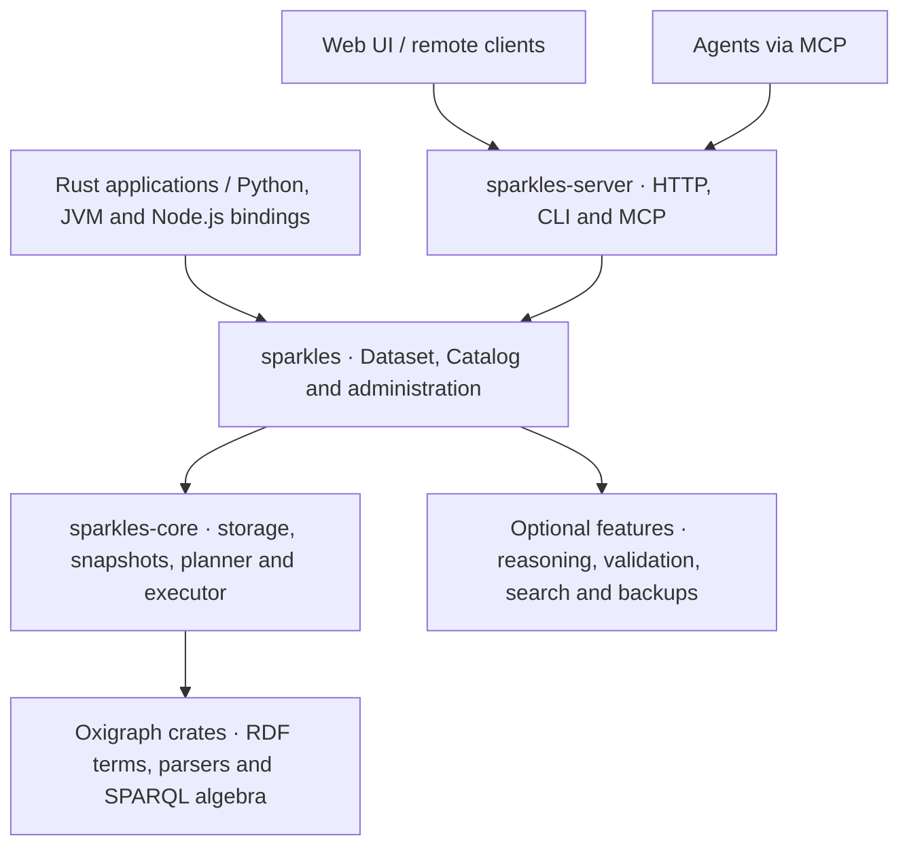

# Sparkles

Sparkles is a fast RDF, SPARQL and OWL database written in Rust. It reimplements
[Apache Jena](https://jena.apache.org/) and Fuseki, with their protocols, semantics and
operational model, on the index and execution architecture of
[QLever](https://github.com/ad-freiburg/qlever). It ships as an embeddable library with
Rust, Python, JVM and JavaScript APIs, a Fuseki-compatible server and CLI, and a web UI.
The JVM binding implements Jena's `DatasetGraph`, letting Java and Kotlin applications
use Sparkles through Jena's existing query, model and transaction APIs.

> [!WARNING]
> Sparkles is experimental. There are no releases, and the on-disk format, HTTP API, CLI
> and library APIs can change in any commit without a migration path. Don't use it for
> data you can't regenerate.
>
> Much of the code, tests and documentation was written with AI models, directed and
> reviewed by the maintainer. The W3C conformance suites and differential tests are the
> main safeguard, but expect bugs. Issues and bug reports are welcome.


## Why Sparkles

Jena and Fuseki have the protocols, tools and operational model that RDF applications
depend on, and QLever has an index and executor built for speed. Sparkles puts the first
on top of the second:

1. **Jena-compatible where users can see it.** Anything that talks to Fuseki keeps
   working. Sparkles implements the SPARQL 1.1 Query, Update and Graph Store protocols,
   Fuseki's endpoints and `/$/` admin API, Jena's formats and dataset semantics, and
   TDB2's model of bulk loads, transactions, compaction and backups. The JVM binding
   brings that compatibility into the application: open a Sparkles dataset and keep
   using Jena's `Model`, RIOT, `Txn` and `QueryExecution` APIs.
2. **QLever-style internals where performance matters.** Terms are 64-bit ids with
   numbers and dates stored inline, indexes are sorted and compressed permutations, and
   a cost-based planner drives column-at-a-time execution. Sparkles adds MVCC
   transactions, durable commits, online compaction and a history that can be read,
   diffed and branched.
3. **Library first.** The engine is a library with no HTTP server. The server, the CLI
   and the Python, JVM and Node.js bindings are built on its public API, so an embedded
   program gets the same features as the server. The term model, parsers and SPARQL
   algebra come from the Oxigraph project's crates.

## Getting started

Build from source, run it with Nix, or use Docker. Building the UI first embeds it in
the binary.

```sh
pnpm -C ui install && pnpm -C ui build        # the web UI, optional
cargo install --path crates/sparkles-server   # installs the `sparkles` binary
nix run github:kclejeune/sparkles -- serve --data ./data
docker compose up --build -d                  # UI and server on 127.0.0.1:3030
```

Load a file and serve it, or create a dataset on a running server:

```sh
sparkles load --loc ./books books.ttl
sparkles serve --data ./data --loc books=./books

curl -X POST 'localhost:3030/$/datasets' -d 'dbName=films&dbType=persistent'
curl -X POST 'localhost:3030/films/data?default' -H 'Content-Type: text/turtle' --data-binary @films.ttl
```

Query it over HTTP or from the command line:

```sh
curl localhost:3030/books/sparql -H 'Accept: text/csv' \
  --data-urlencode 'query=SELECT ?s ?p ?o WHERE { ?s ?p ?o } LIMIT 10'
sparkles query --loc ./books 'SELECT (COUNT(*) AS ?n) { ?s ?p ?o }'
sparkles query --data books.ttl --query q.rq   # files in memory, no database
```

The web UI is at <http://localhost:3030/ui/>. [docs/USAGE.md](docs/USAGE.md) covers
running and operating the server, and `sparkles help COMMAND` describes each command.

### Libraries and bindings

**Use Sparkles through Apache Jena.** The JVM library provides Jena's `DatasetGraph`:
change the line that opens a TDB2 dataset and keep using Jena's query, model, RDF I/O
and transaction APIs.

```java
try (DatasetGraphSparkles dsg = SparklesDatasets.open(Path.of("mydb"))) {
    Dataset ds = DatasetFactory.wrap(dsg);
    Txn.executeRead(ds, () -> { /* QueryExecution, Model and RIOT as usual */ });
}
```

[The JVM/Jena guide](docs/USAGE.md#jvm-apache-jena) covers building the binding,
queries, updates, transactions, importing TDB2 data and compatibility differences.

The `sparkles` Rust crate embeds the engine with no HTTP server or async runtime by
default:

```rust
use sparkles::Dataset;

let ds = Dataset::open("mydb")?;                 // or Dataset::memory()
ds.load_file("data.ttl.gz")?;
for row in &ds.select("SELECT ?s ?name { ?s <http://xmlns.com/foaf/0.1/name> ?name }")? {
    println!("{} {}", row.get("s").unwrap(), row.get("name").unwrap());
}
```

| API | Integration and examples |
|---|---|
| [Rust](docs/USAGE.md#embedding-the-library) | `Dataset`, query builders, extension functions and administration handles. |
| [Python](docs/USAGE.md#python) | A pyoxigraph-style API and an rdflib store plugin. |
| [Node.js / TypeScript](docs/USAGE.md#javascript-and-typescript) | RDF/JS terms and asynchronous results from the embedded engine. |

The binding packages are not published to a registry. Build them with
`mise run jvm:build`, `mise run py:build` or `mise run node:build`.

### Agents

`sparkles mcp` serves a database to an MCP host such as Claude Code or Claude Desktop.
A running server also serves MCP over HTTP at `/$/mcp`, with the caller's grants.

```sh
claude mcp add sparkles -- sparkles mcp --loc ./books
```

Agents get tools to explore the schema, check and run queries, recall and record facts,
and hand a query to the web UI for a person to review
([usage](docs/USAGE.md#mcp-server-llm-agents)). With a model configured, the server's
Ask bar answers questions in plain language ([usage](docs/USAGE.md#asking-questions-with-a-model)).

## Architecture



Embedded programs and the server share the same library and engine. Jena and Fuseki
guide compatibility. QLever inspires the sorted indexes and columnar execution.
Sparkles adds durable transactions, online compaction, history and branches in the
shared Rust engine. [docs/ARCHITECTURE.md](docs/ARCHITECTURE.md) explains the boundaries,
optimization mechanisms and implemented decisions across the design specs.

## Features

* **Storage and history.** MVCC snapshots, durable commits, parallel bulk loads,
  online compaction, historical reads, diffs, branches and merges.
* **Query.** Passes the SPARQL 1.1 and 1.2 W3C suites, with Jena ARQ extensions,
  federated `SERVICE`, query plans and execution budgets.
* **Search.** Jena-compatible full-text search, HNSW vector similarity, embeddings
  computed on write by a provider or a local model, path search and indexed GeoSPARQL
  1.1.
* **Reasoning and validation.** Incremental RDFS, OWL 2 RL and Jena rules, SHACL and
  ShEx validation, and schema reports.
* **Server.** Fuseki endpoints and administration, authentication and access control,
  stored queries, GraphQL, metrics, deployment with Docker, Helm and NixOS, and a Home
  Manager module for the client.
* **Agents.** MCP tools, questions answered with checked queries, document ingestion
  and agent memory with sources and branch review.
* **Tooling.** Jena-style CLI commands, SPARQL and RDF formatting and linting, and an
  editor language server.

[docs/FEATURES.md](docs/FEATURES.md) lists every feature and the known gaps.

## Performance

These figures come from one Intel Core i5-13500 with 16 GiB of RAM, with result caches
off and every engine's answers checked before timing.

| 10.5M triples | Sparkles | Best of the others |
|---|---|---|
| Bulk load | **3.9 s** | QLever 9.7 s |
| 28 benchmark queries | **Fastest on 27 of 28**, a median 3.9× faster than QLever | Fluree's `star-lookup` lead is within 10% |
| WatDiv, 20 templates | **4.84 ms** geometric mean | Fluree 7.41 ms |
| Throughput, 16 clients | **241 q/s** | QLever 92 q/s |
| Durable commit of one new literal | 1.28 ms | **Oxigraph 0.93 ms**, without synchronizing |
| Server memory after the run | 840 MiB, 379 MiB of it block cache | **QLever 653 MiB** |

On English DBpedia, 1.24 billion triples, Sparkles loads in 480 s against QLever's
1,674 s and Fluree's 2,919 s. It is faster than QLever on all 29 warm queries both
answer and on 29 of 31 cold ones, and faster than Fluree on every cold query. The bindings are faster than TDB2, pyoxigraph and Oxigraph's JavaScript
package on most of the same queries, and slower on some small lookups.

Sparkles uses more memory than QLever in exchange for this speed, mostly for a 1 GiB
decoded-block cache per dataset that can be made smaller.
[docs/BENCHMARKS.md](docs/BENCHMARKS.md) has every measurement, the cost of each memory
tradeoff and every case where Sparkles loses.

## Comparison

| Engine | Where Sparkles stands |
|---|---|
| [Apache Jena / Fuseki](https://jena.apache.org/) | The same protocols, endpoints, admin API, CLI model and ARQ extensions, on sorted columnar indexes. Reasoning is materialized, apart from RDFS on read, and there is no ontology API or JavaScript functions. |
| [QLever](https://github.com/ad-freiburg/qlever) | The same index and execution architecture, plus exact term identity, MVCC updates, the Graph Store Protocol, history, reasoning and validation. QLever is built for larger data and uses less memory. |
| [Fluree](https://github.com/fluree/db) | Both keep history and branches. Sparkles adds full W3C SPARQL conformance and Fuseki compatibility, and has no policies stored in the data or clustering. |
| [Oxigraph](https://github.com/oxigraph/oxigraph) | Sparkles uses Oxigraph's parsers and SPARQL parser with its own storage and planner. Sparkles synchronizes each commit, which makes single writes slower than Oxigraph's defaults. There is no WebAssembly build. |

[docs/COMPARISON.md](docs/COMPARISON.md) lists the gaps per engine and where Sparkles
departs from Jena and QLever on purpose.

## Web UI

The web UI is embedded in the server. It has a query editor with results as tables,
graphs and maps, a resource explorer, schema and validation views, branch history and
merges, the Ask bar, and agent memory.

<table>
  <tr>
    <td></td>
    <td></td>
  </tr>
  <tr>
    <td>A question answered with a checked query and a cited summary</td>
    <td>A query an agent handed over for review</td>
  </tr>
  <tr>
    <td></td>
    <td></td>
  </tr>
  <tr>
    <td>Branches and their history</td>
    <td>A merge preview with a conflict to resolve</td>
  </tr>
  <tr>
    <td></td>
    <td></td>
  </tr>
  <tr>
    <td>The query editor and its results</td>
    <td>The resource explorer</td>
  </tr>
  <tr>
    <td></td>
    <td></td>
  </tr>
  <tr>
    <td>The schema browser</td>
    <td>GeoSPARQL results on a map</td>
  </tr>
  <tr>
    <td colspan="2" align="center"></td>
  </tr>
  <tr>
    <td colspan="2" align="center">What agent memory holds, with sources</td>
  </tr>
</table>

<details>
<summary>More screenshots: Ask progress</summary>


</details>

## Documentation

[The documentation index](docs/README.md) groups all guides and references by task,
including benchmarks, editor setup, design specs and UI development.

| Document | Contents |
|---|---|
| [Usage](docs/USAGE.md) | Server and CLI workflows, libraries and bindings, MCP, backups, and deployment with Docker, Kubernetes and NixOS. |
| [Architecture](docs/ARCHITECTURE.md) | Library boundaries, storage, execution, optimizations and implemented design decisions. |
| [Features](docs/FEATURES.md) | The capability inventory and known gaps. |
| [HTTP API](docs/API.md) | Fuseki endpoints and Sparkles administration extensions. |
| [Development](docs/DEVELOPMENT.md) | Project layout, builds, tests, mise tasks, Nix and third-party licenses. |

## Project layout

* `crates/sparkles-core` — storage, snapshots, query planning and execution.
* `crates/sparkles` — the public library API and optional feature integrations.
* `crates/sparkles-server` — the HTTP server, CLI and MCP endpoints.

[The development guide](docs/DEVELOPMENT.md#project-layout) maps the remaining crates,
bindings and UI to their roles and Jena counterparts.

## Development

`mise run ci` runs the full checks. `mise run ci:fast` runs the smaller set for
iteration. [The development guide](docs/DEVELOPMENT.md) covers setup, individual tasks
and the W3C and Jena compatibility suites.

## License

Sparkles is licensed under the [Apache License 2.0](LICENSE). The vendored `spargebra`
keeps its MIT OR Apache-2.0 license. The licenses of the crates and npm packages that
ship in the binary are in [THIRD_PARTY_LICENSES.md](THIRD_PARTY_LICENSES.md) and
[THIRD_PARTY_LICENSES-UI.md](THIRD_PARTY_LICENSES-UI.md).
