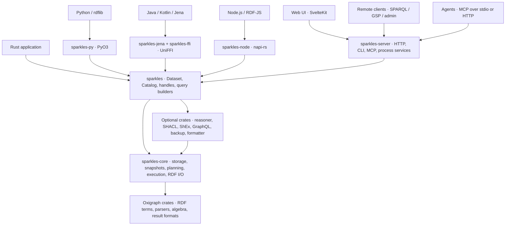
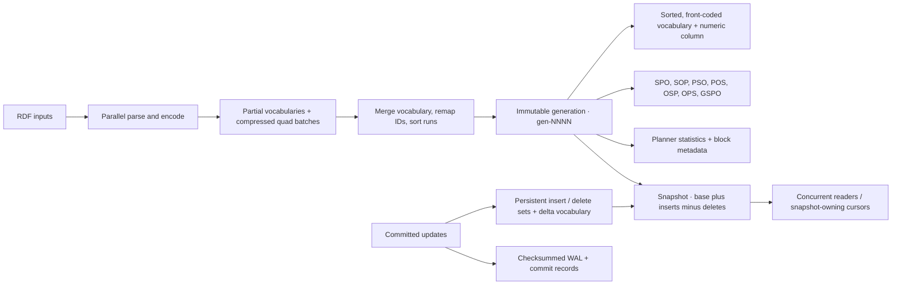
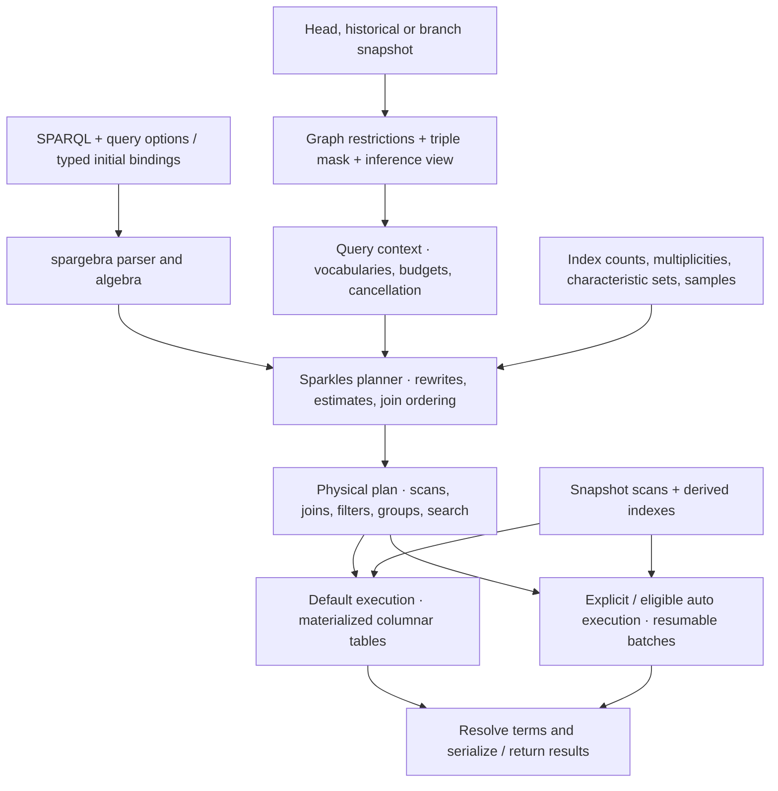
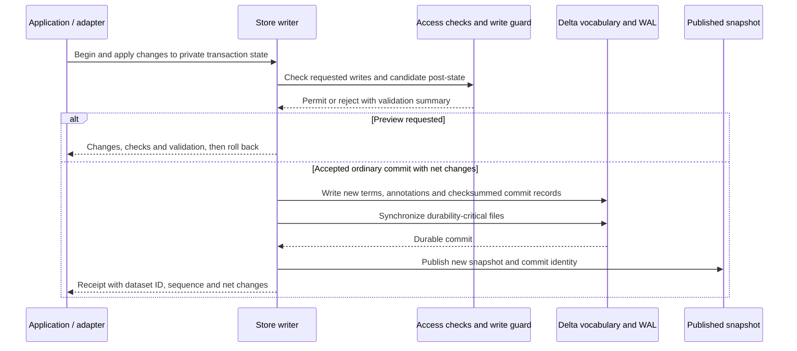
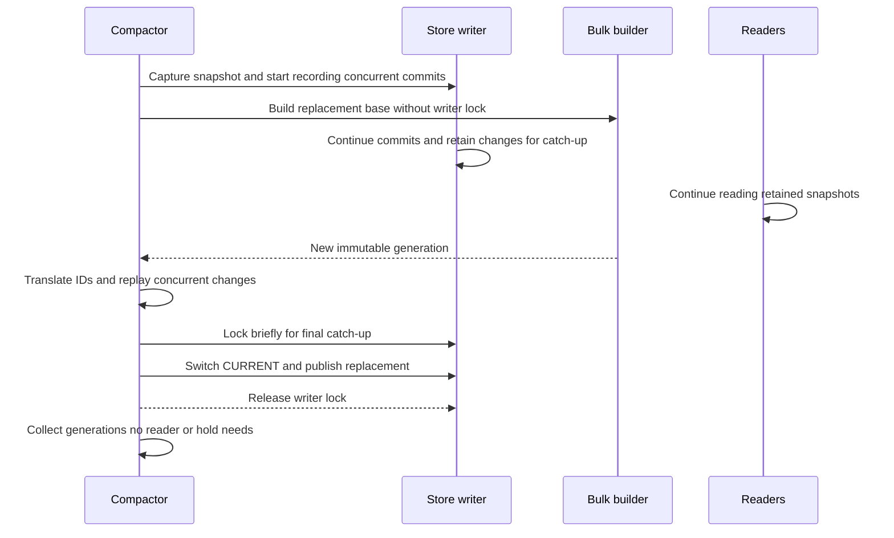
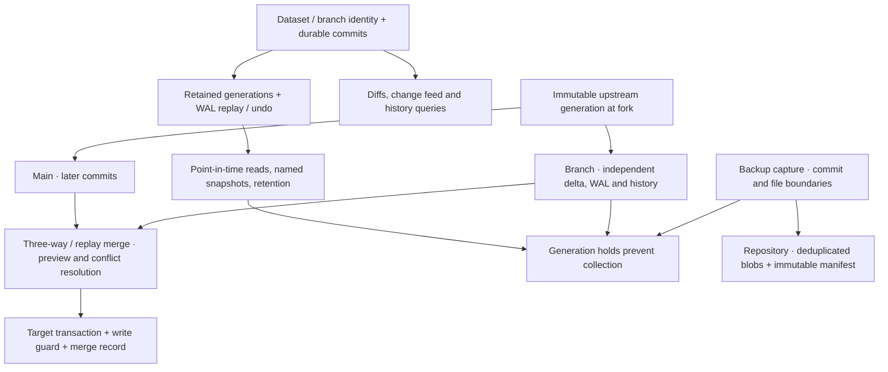
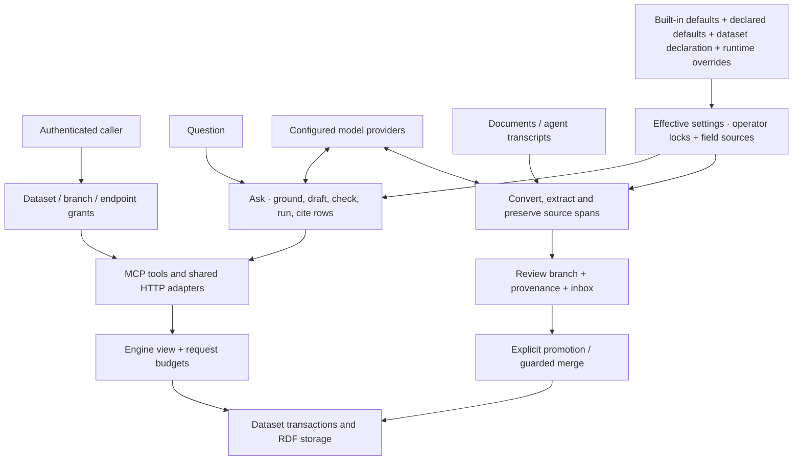

# Sparkles architecture

Sparkles is an embeddable RDF database with a Rust storage and query engine, a
Fuseki-compatible server, and language bindings. Its central choice is to preserve
Jena's observable semantics and operational model while using QLever-style sorted
indexes and columnar execution. Transactions, history, branches and derived indexes
extend that foundation.

This document describes the implementation in this checkout as of 2026-10-10. It
connects the architectural decisions across the [design specs](specs/README.md);
it does not treat every phase of a spec as implemented. The code and each spec's
**Outcome** describe what shipped. [FEATURES](FEATURES.md) inventories behavior,
[API](API.md) defines the HTTP surface, and [BENCHMARKS](BENCHMARKS.md)
records performance evidence and reproduction instructions.

* [Compatibility, execution and reuse](#compatibility-execution-and-reuse)
* [Library boundaries and entry points](#library-boundaries-and-entry-points)
* [Storage: immutable indexes with transactional overlays](#storage-immutable-indexes-with-transactional-overlays)
* [Query execution and where optimizations live](#query-execution-and-where-optimizations-live)
* [The commit boundary: durability, validation and previews](#the-commit-boundary-durability-validation-and-previews)
* [Compaction, history, branches and backups](#compaction-history-branches-and-backups)
* [Derived data: search, schema and inference](#derived-data-search-schema-and-inference)
* [Server policy, agents and tooling reuse the engine](#server-policy-agents-and-tooling-reuse-the-engine)
* [Implemented boundaries and evidence](#implemented-boundaries-and-evidence)

## Compatibility, execution and reuse

The phrase “Jena on QLever-style internals” describes a division of responsibilities.
The Rust engine does not run Jena, Fuseki or QLever underneath it. The JVM binding
does depend on Jena to expose its Java APIs and to support ARQ fallback.

| Influence | What Sparkles takes from it | Where Sparkles makes its own choices |
|---|---|---|
| Jena and ARQ | RDF and dataset semantics, SPARQL and ARQ extensions, functions, reasoning profiles, validation and tool behavior | A Rust planner and executor, term IDs, materialized reasoning with incremental maintenance, and native APIs |
| Fuseki / TDB2 | HTTP protocols and endpoint conventions, the `/$/` administration model, multiple readers and one writer, bulk loading, generation compaction and backups | Axum HTTP handling, authentication and engine-enforced views, durable commit identity, retained history and branches |
| QLever | Tagged 64-bit IDs, sorted vocabularies, compressed permutation indexes, cost-based join planning, columnar tables and specialized operators | Exact RDF term identity, durable writes, persistent deltas, online compaction, historical reads and derived-index maintenance |
| Oxigraph crates | `oxrdf` terms, RDF parsers and serializers, `sparesults`, `spargebra` algebra and parsing, and XSD value types | Sparkles replaces the database, optimizer and evaluator. It does not use RocksDB, `sparopt` or `spareval` |

This boundary lets an application retain its RDF protocols while changing the
execution and storage architecture. Compatibility is tested behavior, rather than
binary compatibility with TDB2 files or Jena's Lucene indexes. Fuseki configuration
import translates the supported configuration into Sparkles settings and migration
commands. It is not a Java assembler runtime. See [AUDIT](AUDIT.md),
[COMPARISON](COMPARISON.md), [G06](specs/G06-arq-query-extensions.md) and
[G08](specs/G08-fuseki-configuration.md).

## Library boundaries and entry points

Arrows show calls and integration boundaries, not an exhaustive Cargo dependency
graph. Some satellites operate directly on core snapshots. The formatter operates
on syntax and does not need a live store. The server also calls satellite crates and
lower-level APIs where its orchestration requires them.

**`sparkles-core` owns data and execution invariants.** Its public modules cover IDs,
vocabularies, indexes, building, storage, access views, query execution, search,
history, guards and RDF I/O. It knows about permissions expressed as engine views,
but not HTTP credentials or response codes.

**`sparkles` is the application-facing facade.** `Dataset` is a cheap, shared handle
around a `Store` and dataset state. Opening it installs persisted configuration such
as validation guards, query defaults, reasoning records, stored queries and GraphQL
mapping. Administration handles expose history, branches, schema, indexes, settings,
reasoning, validation and backups. `Catalog` manages named datasets, directory
locking and reservations for operations such as clone and restore. A dataset name
is an alias. Durable UUIDs identify datasets independently of renaming.

**Optional features keep embedding lightweight.** The Rust facade has no default
features and needs no HTTP server or async runtime for ordinary database use. Cargo
features add text, geometry, reasoning, validation, GraphQL, backups and formatting.
The backup facade supplies a blocking bridge to its async repository implementation.
The server enables a broader set of features.

**Adapters share database semantics, with different transport lifecycles.** Python
uses PyO3, the JVM uses a UniFFI library behind Jena's `DatasetGraph`, and Node uses
napi-rs with RDF/JS terms and work off the JavaScript thread. The JVM query and update
engines can choose ARQ fallback when native execution cannot support a Java-side
feature. `sparkles-client` and `js/client` instead talk to remote endpoints. They do
not embed another store. The formatter has a separate browser WASM build. The
database engine itself has no WASM build.

The library-first boundary is implemented, but the server is more than a thin
transport wrapper. Its dataset object wraps the library's `Dataset` and still
dereferences a hidden `DatasetState` for existing handlers. Authentication, task
queues, schedulers, layered operator settings, model providers and agent workflows
remain process concerns. The parity map between HTTP and the library explicitly records these
exceptions, and the bindings matrix includes intentional planned entries. A new
HTTP endpoint therefore does not automatically imply a method in every binding.

Sources: [facade](../crates/sparkles/src/lib.rs),
[Dataset](../crates/sparkles/src/dataset.rs), [Catalog](../crates/sparkles/src/catalog/mod.rs),
[server state](../crates/sparkles-server/src/state.rs),
[HTTP and library parity](../crates/sparkles/tests/parity.rs),
[bindings matrix](../crates/sparkles/bindings.toml), and
[P01](specs/P01-python-bindings.md), [P02](specs/P02-rust-client.md),
[P03](specs/P03-query-extensions.md), [P04](specs/P04-jvm-bindings.md),
[P05](specs/P05-node-bindings.md), [P06](specs/P06-library-admin-api.md).

## Storage: immutable indexes with transactional overlays

### Terms stay compact without losing RDF identity

Every stored term is represented by a 64-bit `Id`: a four-bit tag and a 60-bit
payload. Canonical, representable integers, decimals, doubles, booleans and dates
can be inline. Arithmetic and comparison can then avoid dictionary lookup.

Inlining preserves both value and lexical identity. For example,
`"1"^^xsd:integer` can be inline, while `"01"^^xsd:integer` remains a vocabulary
entry. They can compare equal numerically without becoming the same RDF term.
Values that cannot fit losslessly remain dictionary terms too.

There are three vocabulary domains: the sorted immutable **base**, an append-only
**delta** for newly stored terms, and a **local** vocabulary for query-created terms.
Base vocabulary IDs follow key order and permit prefix and range lookups. That ordering
does not extend to insertion-ordered delta IDs, and raw ID ordering is not general
SPARQL value ordering. Execution resolves those distinctions. A persisted numeric
column also avoids repeatedly decoding numeric literals whose exact lexical forms
keep them in the vocabulary.

### Sorted permutations make reads cheap and deltas make writes possible

The six triple permutations each carry the graph column. GSPO adds a graph-leading
order. Blocks contain up to 32,768 rows, with columns encoded separately using delta
and zig-zag varints followed by LZ4 compression. In-memory first and last keys and offsets
let scans skip blocks and count ranges without reading every row. Scans can decode
only the columns they need, and decoded blocks are cached.

The base vocabulary is front-coded and memory-mapped. A sparse in-memory vocabulary
index narrows cold lookups to a group of blocks. Read hints suppress indiscriminate
kernel read-ahead and prefetch the byte ranges an index scan will actually use.
These mechanisms optimize disk reads independently of result caching.

Updating all sorted files in place would discard their useful immutability. Instead,
each permutation has structurally shared ordered sets for inserts and deletes.
Transactions modify a private delta and publish a new immutable snapshot through
`ArcSwap`. Existing readers retain their old snapshots. Writes are serialized through
one writer per store. This is the TDB2 multiple-reader, single-writer model on a
QLever-style base-plus-delta representation.

The bulk builder uses Rayon, partial vocabulary merges, bounded sort chunks and
external runs. It constructs partner permutations from shared streams and collects
statistics while writing them. This pays the indexing cost in batches rather than
as a sequence of ordinary inserts. Bulk publication can replace a generation;
ordinary incremental writes append to its WAL and overlay.

Sources: [IDs](../crates/sparkles-core/src/id.rs),
[vocabularies](../crates/sparkles-core/src/vocab.rs),
[indexes and read hints](../crates/sparkles-core/src/index.rs),
[builder](../crates/sparkles-core/src/builder.rs), and
[store](../crates/sparkles-core/src/store.rs).

## Query execution and where optimizations live

The parser supplies syntax and algebra. Sparkles then chooses physical operators
using its own statistics and cost model. Dynamic programming searches connected
join groups while retaining useful sort orders. A greedy plan bounds the search;
larger groups use bounded rounds or the greedy fallback. Estimates include distinct
values, predicate multiplicities, characteristic sets and sampled filter selectivity.
Planning work is bounded instead of exhaustively enumerating arbitrary join graphs.

Execution uses columns of IDs rather than RDF objects per intermediate row. Sorted
inputs support merge and galloping joins. Other shapes use hash or index joins.
Operators still preserve SPARQL duplicates, unbound-variable compatibility, graph
semantics and expression errors. Fast paths have applicability checks and generic
fallbacks.

| Optimization location | Implemented mechanism | Work it avoids |
|---|---|---|
| Storage scans | Bound-prefix scans, selective column decoding, block metadata, prefetch and decoded-block caching | Reading irrelevant blocks or decoding unused columns |
| Filters | Numeric and lexical ID ranges, prefix and key-range pushdown, ID-based tests, evaluation once per distinct value | Scanning rejected ranges and repeatedly decoding or evaluating the same term |
| Join planning | Pruned dynamic programming, sampled selectivity and characteristic sets | Expensive join orders and excessive planning work |
| Selective joins | Batch distinct input keys, cluster their index seeks, gallop within blocks | Scanning an entire predicate for a small input |
| Subject stars | Fuse consecutive constant-predicate index joins. Choose a subject sweep or separate probes by estimated block cost | Repeated subject reads and intermediate join tables |
| Counts and groups | Exact metadata counts corrected for delta and graph scope, per-key run counts, incremental aggregate state | Materializing rows that are needed only to count or aggregate |
| ORDER BY with LIMIT | Bounded top-k heaps, first-key screening and eligible scans in value order | Full sorts and evaluating later keys for rows already excluded |
| Paths and existence | Batched frontier expansion, eligible EXISTS decorrelation and specialized anti joins | One graph walk or correlated subquery execution per outer row |
| Search planning | Text subject restriction, spatial range, join and nearest-neighbor rewrites, exact vector top-k rewrites | Producing large candidate sets before applying selective query structure |
| Federation | SERVICE loop and bulk batching, `VALUES` or UNION requests, caller-scoped remote-result caching | Repeated network round trips for correlated bindings |

These optimizations sit inside `sparkles-core`, so embedded applications can use
them too. The authoritative switch list is
[`Optimizations`](../crates/sparkles-core/src/sparql/ctx.rs). Switches support comparison
against generic execution through `QueryOptions` and
`SPARKLES_DISABLE_OPTIMIZATIONS`. The detailed implementations include
[join ordering](../crates/sparkles-core/src/sparql/joinorder.rs),
[index joins and star fusion](../crates/sparkles-core/src/sparql/indexjoin.rs),
[eager execution](../crates/sparkles-core/src/sparql/exec.rs), and
[SERVICE enhancement](../crates/sparkles-core/src/sparql/enhancer.rs).

The [query optimization reference](internals/OPTIMIZATIONS.md) records the individual
fast paths, their applicability and the measurements behind cost-model choices.

### Eager execution and cursors have different memory costs

The ordinary query path remains eager: operators materialize their results within
budgets. [X05](specs/X05-streaming-query-execution.md) adds explicit SELECT,
graph and ASK execution with snapshot-owning cursors. Eligible automatic execution
currently selects large immutable scans and particular OPTIONAL COUNT plans, under
the documented conditions. It is not a universal switch to lazy execution.

Cursors pull bounded batches. Plain immutable scans can share read-only decoded
columns, while resumable joins avoid materializing their complete output. Hash joins
still retain a build side, DISTINCT retains seen values, and some groups retain
aggregate state. ORDER BY with LIMIT retains a heap. A full sort and DESCRIBE remain
barriers. Unsupported operators can materialize under the same limits, or be rejected
when the caller selects `RejectMaterialization`. There is no disk spill.

HTTP streaming adds a producer and bounded response queues, with cancellation and
backpressure maintained through body completion. Streaming serialization of an
eager result does not make its upstream execution incremental. Foreign bindings
also have their own batching and term-copy costs. Query budgets account for engine
state. Application-retained copies and shared process caches have separate costs.

### Caches are separated by what they can safely reuse

The decoded-block cache avoids decompressing storage repeatedly. The subtree-result
cache instead reuses deterministic operator results keyed by canonical plan,
generation instance, commit, dataset scope and triple mask. It excludes results with
query-local terms, nondeterministic functions or SERVICE. Cache hits still respect
the request's limits. SERVICE has its own cache, scoped by caller and endpoint so
credentials and visible data do not leak between callers.

This separation explains a deliberate tradeoff: decoded caching and eager tables
buy throughput at a memory cost. Performance is workload-dependent, and removing
one cache does not remove the others. Consult
[memory measurements](BENCHMARKS.md#memory-and-the-speed-it-buys) and
[where Sparkles loses](BENCHMARKS.md#where-sparkles-loses), rather than assuming
every optimization beats every Jena or QLever query.

Sources: [cursor execution](../crates/sparkles-core/src/sparql/cursor.rs),
[result cache](../crates/sparkles-core/src/sparql/cache.rs),
[SERVICE cache](../crates/sparkles-core/src/sparql/svccache.rs),
[C01](specs/C01-observability-and-budgets.md),
[G10](specs/G10-service-enhancer.md), and
[P03](specs/P03-query-extensions.md).

## The commit boundary: durability, validation and previews

All write surfaces ultimately meet the store's transaction boundary: SPARQL Update,
graph writes, imports, RDF Patch, reasoning output, embedding output and merges.
For an ordinary incremental persistent write, the path is:

Readers see the old snapshot until publication. A durable dataset has a UUID and a
monotonic commit sequence. A transaction with no net change normally returns the
unchanged head without allocating a commit. Receipts attach identity, counts and
validation to the write, and HTTP headers expose the same identity to clients.
Checksummed replay distinguishes committed records from torn tails. An uncertain
write or sync failure poisons the writer so later writes cannot reuse a sequence.
The commit catalog can be repaired from durable storage.

The bulk path builds and validates a replacement generation, then atomically
switches `CURRENT`. It does not append one WAL operation for every bulk quad.
Experimental, opt-in group commit shares a durability fence across admitted writes
and publishes only the durable prefix. It preserves durability rather than
acknowledging unsynchronized writes, and guarded or otherwise ineligible writes
use the ordinary path. In-memory stores share the commit and snapshot model without
disk durability.

**Validation belongs at this boundary.** The engine invokes a configured write guard
on the candidate post-state before commit. The facade supplies SHACL or ShEx guards,
including incremental affected-node validation and full-validation fallbacks.
Configuration determines warnings or rejection and how existing violations form a
baseline. Missing required guard support fails closed. Keeping the hook in the store
means another adapter cannot accidentally bypass validation by avoiding HTTP.

**A preview runs the write's checks and rolls back.** Dry runs report proposed changes,
validation, quota and preconditions through the transaction machinery. They are not
an alternative write parser, and they do not reserve the head for a future write.
Commit preconditions must still protect any later application of the preview.

Sources: [transaction commit](../crates/sparkles-core/src/store.rs),
[group commit](../crates/sparkles-core/src/store/group.rs),
[guard contract](../crates/sparkles-core/src/guard.rs),
[library guard](../crates/sparkles/src/write_guard.rs),
[CI](specs/CI-commit-identity.md), [C10](specs/C10-write-time-validation.md),
[C15](specs/C15-write-previews.md), and [F10](specs/F10-replication.md).

## Compaction, history, branches and backups

An immutable generation is both an execution asset and a unit of lifecycle
management. Compaction keeps growing deltas from dominating query cost without
requiring all writers to wait for an index rebuild.

Compaction translates IDs into the new vocabulary and carries later commits into
the replacement WAL under their original sequences. Physical layout changes do not
create a logical data commit. Policies trigger the build from delta size, WAL size,
age or idle time. The server supplies scheduling while the engine owns the build,
catch-up and switch. Old snapshots and history holds govern reclamation.

**History reconstructs readable states.** Point-in-time selectors resolve to commits
whose generations remain available. Replay can start at a known state, using a sparse
WAL index and replaying forward or undoing changes backward. Named snapshots and a
retention window keep needed generations. Warm snapshots can retain materialized
states. A retained change log is not itself a guarantee that the original state is
still reconstructable.

**Diffs and feeds reuse commit changes.** Within available logs, diffs read the changes
between commits. Across rebuild boundaries they can compare sorted states. The
change feed pages or streams commits, and history queries expose changes through
SPARQL. Large bulk commits into non-empty datasets can be represented in the change
log by counts only, so detailed changes are not guaranteed for every commit.

**Branches reuse storage rather than copying a dataset.** A branch is an ordinary
store with its own writes and history, linked to an immutable upstream state. Linked
generations share base files. Branch overlays and vocabulary boundaries keep later
upstream writes from changing the fork. Three-way and replayed merges use recorded
ancestry, explicit conflicts and resolutions, and normal guarded commits on the
target. Recursive virtual bases and offline relinking are implemented. A clone is
different: it creates an independent dataset with recorded origin.

**Backups capture a consistent dataset, then transfer it.** A capture records a commit
and the file boundaries needed to restore it, while a generation lease prevents
collection. Repository manifests refer to content-addressed pieces and appended
file ranges, avoiding repeated uploads of unchanged data. Restore stages files and
verifies them before swapping the target. Filesystem and S3 repositories are the
primary backends. GCS and Azure are optional features not tested in CI. Policies and
GC share the repository engine. Optional encrypted repositories add authenticated
objects, keyed IDs and key-management workflows.

Sources: [compaction](../crates/sparkles-core/src/store/compaction.rs),
[linked generations](../crates/sparkles-core/src/store/link.rs),
[backup capture](../crates/sparkles-core/src/store/backup.rs),
[repository engine](../crates/sparkles-backup/src/lib.rs),
[C06](specs/C06-clone-to-sandbox.md), [C13](specs/C13-automatic-compaction.md),
[F05](specs/F05-snapshot-repositories.md),
[F06](specs/F06-snapshots-and-point-in-time.md),
[F09](specs/F09-branches-and-merges.md), and
[F11](specs/F11-encryption-at-rest.md).

## Derived data: search, schema and inference

RDF plus durable commits remains the authority. Auxiliary indexes and reports have
their own build identities, freshness rules and failure behavior. They do not all
share one maintenance strategy.

| Derived facility | How it relates to storage and execution | Consistency and cost decision |
|---|---|---|
| Full-text | Tantivy documents keyed by quad term keys. Jena's `text:query`, BM25 and highlighting | Writes stage documents in the commit path. Segment commits and checkpoints are deferred. Searches reconcile candidates with their snapshot. WAL recovery catches up or rebuilds the index. Historical search is unsupported. |
| Vectors | Packed vectors and optional HNSW per generation. Exact delta overlay and `spk:vectorSearch` | Base builds run in the background and exact search remains available while HNSW builds. Compaction rebuilds the graph. Explicit approximate search trades recall for speed. Eligible ordinary cosine and dot-product top-k rewrites stay exact. |
| Embeddings | Workers prepare source inputs, call an external provider, then apply vectors as ordinary commits | Provider latency stays outside the original write. Apply rechecks changed inputs, stale work is discarded, and embedding commits do not schedule themselves. Catch-up and freshness are visible. |
| Spatial | Parsed geometry column, packed R-tree base and snapshot overlays. GeoSPARQL and Jena spatial functions | Range, spatial-join and nearest-neighbor plans use the index. Index failure falls back to query evaluation without it. Rebuild restores acceleration. Compaction prebuilds geometry state to shorten its final switch. |
| Schema | Exact observed class and predicate counts, graph scope, declarations and SHACL constraints | Reports can be maintained from changes and compared across commits. Draft shapes describe observations. Installing a write guard makes them an enforced contract. |
| Inference | RDFS, OWL 2 RL and Jena rules materialized through semi-naive forward chaining. RDFS also available on read | Materialized runs record their source state and publish inferred data through guarded writes. Incremental maintenance falls back to a full run for unsupported rules or unavailable history. Stale inferences are reported rather than silently represented as current. |

Several details follow from making auxiliary data recoverable. Text documents use
term keys rather than generation-local IDs, so compaction can preserve the text
index. Vector and spatial structures instead depend on a generation and validate
their persisted files against their build and configuration identity. A text index undergoing
startup recovery can refuse text search while ordinary RDF reads continue. Spatial
and vector paths have scan and exact alternatives. These are different promises.

Schema discovery, reasoning and validation are separate layers. Schema discovery
reports observed data and declarations, reasoning derives consequences, and
SHACL or ShEx validation checks a chosen contract. Read-only GraphQL compiles mapped fields into
batched SPARQL algebra on one snapshot, sharing the caller's view, deadline and work
budget across fetch groups. CSVW and CONSTRUCT-template tabular imports produce RDF
for the same store rather than adding a separate table query engine. Registered Rust
scalar, property and aggregate callbacks extend query evaluation per query, with
budgeted and access-filtered reads.

Path search is also an execution extension rather than a separate graph engine.
SPARQL property paths answer connectivity patterns. `SERVICE path:search` returns
paths as solutions, including one, all or k shortest paths and bounded-length
enumeration. It reads the selected snapshot and graph view, can take endpoint
bindings from the surrounding join, and can read weights from RDF reifiers.

Sources: [text lifecycle](../crates/sparkles-core/src/text.rs),
[vector lifecycle](../crates/sparkles-core/src/store/vector.rs),
[spatial lifecycle](../crates/sparkles-core/src/store/geo.rs),
[reasoning facade](../crates/sparkles/src/reasoning/mod.rs),
[C02](specs/C02-schema-discovery.md), [C03](specs/C03-graphql.md),
[C05](specs/C05-tabular-imports.md), [C08](specs/C08-inference-freshness.md),
[F03](specs/F03-full-text-search.md), [F04](specs/F04-vector-search.md),
[F07](specs/F07-path-search.md), [F08](specs/F08-embeddings-on-write.md),
[G01](specs/G01-geosparql.md), [G02](specs/G02-shex.md), and
[G03](specs/G03-shaclc.md).

## Server policy, agents and tooling reuse the engine

Authentication establishes a principal. Authorization produces dataset, branch and
endpoint grants and engine views of graphs and triples. Queries, update WHERE clauses,
schema reports, search candidates and diffs must see that view. Triple protections
construct a masked snapshot with hidden quads represented as removals, and
view-specific caches avoid reusing unrestricted counts or results. Writes check the
requested quads against both start and end states, including requests that would
otherwise be no-ops.

This puts visibility below individual HTTP handlers. GraphQL and MCP can inherit
the same view, and an optimized scan cannot bypass it. Some operations require a
whole-dataset view and reject restricted callers instead: validation and
data-dependent protected change feeds have explicit limits. The inferred graph is
protected separately because unrestricted materialized consequences can reveal
hidden asserted data. Visibility hides triples, not every IRI mentioned by a visible
triple.

Agent memory is RDF with sources, review state, handling of duplicates and superseded facts and
branch-based review. It does not require a model in the database. The MCP tools
check queries against schema, resolve entities, recall cited facts and preview or
perform authorized writes. Stored queries bind typed RDF terms instead of inserting
parameter text into SPARQL, and can also become MCP tools.

The Ask and ingestion services add model orchestration in the server. Ask grounds a
question in the caller's schema and tools, checks a read-only draft, runs it under
the caller's limits and checks summary citations against returned rows. Ingestion
converts documents into facts with cited spans and puts document-derived proposals
on review branches. Agent assertions can be immediately usable while marked
unreviewed. Neither workflow bypasses normal access checks or write guards.

Layered settings currently cover assistant, memory and ingestion configuration.
Built-in defaults, operator-wide defaults, dataset declarations and runtime patches
merge in order. Locks keep declared values authoritative. Responses explain sources,
locks and overrides. Server-wide model settings and write-only secrets extend this
registry, with `sparkles settings --global`, `sparkles secrets` and the Models section
of the server page as their CLI and UI. Dataset
administration handles also expose engine settings. The process's layered registry
is a separate concern, not a universal wrapper around every stored setting.

Observability follows these boundaries: the server owns request IDs, access logs,
Prometheus metrics and OpenTelemetry export, while the engine accepts budgets,
cancellation and progress controls. Long-running library calls accept `Control`;
the server adapts that to cancellable tasks rather than putting a task queue in the
library. Query memory limits estimate and charge engine state and are not a hard cap on
the process's allocator.

The CLI and editor tools follow the same reuse principle. Jena-style file tools use
the common parsers and serializers. The formatter checks semantic preservation and
idempotence. Lint fixes also check meaning. CLI, LSP, HTTP and the optional browser
formatter share these implementations. The OpenAPI description is checked against
the route table, and generated completions and man pages describe the CLI surface.
Compression codecs apply at file and transport boundaries separately from LZ4's
role inside permutation blocks.

Sources: [graph access](../crates/sparkles-core/src/access.rs),
[triple protections](../crates/sparkles-core/src/access/triples.rs),
[layered settings](../crates/sparkles-server/src/settings/mod.rs),
[C09](specs/C09-dataset-access-control.md), [C11](specs/C11-mcp-server.md),
[C12](specs/C12-graph-access-control.md),
[C12b](specs/C12b-triple-access-control.md), [C16](specs/C16-stored-queries.md),
[C17](specs/C17-agent-memory.md),
[C18](specs/C18-natural-language-questions-and-ingest.md),
[C19](specs/C19-layered-settings.md), [G05](specs/G05-command-line-tools.md),
[X01](specs/X01-compression-codecs.md), [X02](specs/X02-formatter.md),
[X03](specs/X03-openapi-and-completions.md), and [X04](specs/X04-linter.md).

## Implemented boundaries and evidence

The diagrams above describe a single-node engine on local disk. The following limits
matter when building on it:

| Area | Current boundary |
|---|---|
| Distribution | RDF Patch application is implemented from F10. Pull replicas, promotion workflows and clustering are not. A change feed is not a running replication system. |
| History | Readability depends on retained generations. Full-text search at historical commits and automatic pin rebasing remain deferred. Branch backups are independent. There is no whole-server backup. |
| Encryption | F11 partially implements optional encrypted backup repositories and operator key workflows. Live dataset files remain unencrypted by Sparkles. Content-defined chunking and KMS-backed dataset encryption are not implemented. |
| Execution | Eager remains the ordinary path. Cursor coverage and automatic selection are partial. No operator-state disk spill exists. Large sorts, retained joins or DISTINCT state can exceed a budget. |
| Query languages | Read-only GraphQL is implemented with limitations on nested query cost. Cypher remains [specified only](specs/F01-cypher.md). There is no implemented property-graph frontend. |
| Reasoning and shapes | Materialization plus RDFS on read is implemented, without a general backward rule engine or ontology object API. Incremental reasoning has full-run fallbacks. ShEx 2.2 and SHACL 1.2 node expressions remain absent. |
| Agents and settings | Implemented model clients are tested against mock endpoints. The real-model evaluation matrix is still open. C18 Phase 6 is not built. |
| Packaging and scale | Bindings are implemented but unpublished to package registries. The engine has no browser WASM build. Published measurements reach 1.24 billion triples on one machine. They do not establish larger or distributed behavior. |

Architecture is checked through several complementary contracts. W3C query and update
and RDF suites cover standards semantics. Jena contract and differential suites
cover dataset behavior, extensions, functions and geometry. Access-control tests
compare restricted execution with a store containing exactly the visible data.
Cursor tests compare small batch sizes with expected results and exercise retention,
cancellation and backpressure. WAL, compaction, history and branch tests exercise
durable state transitions. Parity maps for the API, the library and the bindings check surface
coverage, while benchmark answer checks precede timing.

These are existing safeguards, not a claim that every spec phase or deployment
condition has been tested. Use the [spec status index](specs/README.md),
individual Outcomes and [development guide](DEVELOPMENT.md) when assessing a
particular feature. For changes, follow the invariant to its owner: data visibility
and commit safety in the core, dataset lifecycle in the facade, and caller identity
and process orchestration in the server.
